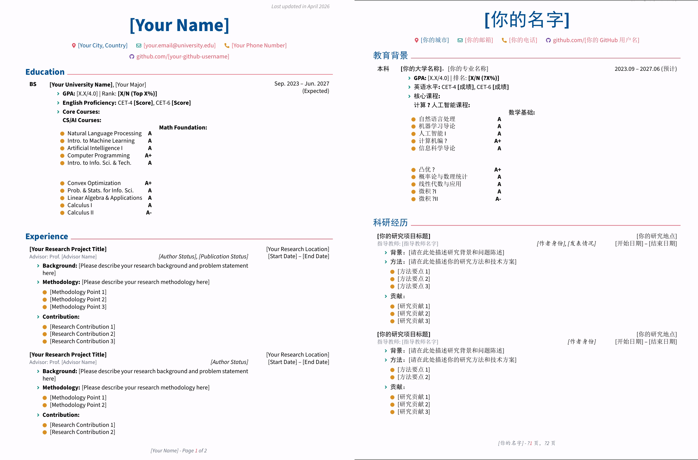

# 保研简历 LaTeX 模板

一个简洁、现代、适合保研 / 夏令营 / 推免申请场景的 LaTeX 简历模板。模板提供中文与英文两个版本。

## 预览

## 如何使用

- 推荐将你的个人信息给claude让他帮你填写后你review。

- 请优先使用 XeLaTeX 编译，中文模板依赖 `ctex` 与系统中文字体。

- 使用`make clean`命令清楚除编译生成的中间文件。注：windows用户请在git bash中使用该命令。请勿在cmd或者powershell中使用该命令。